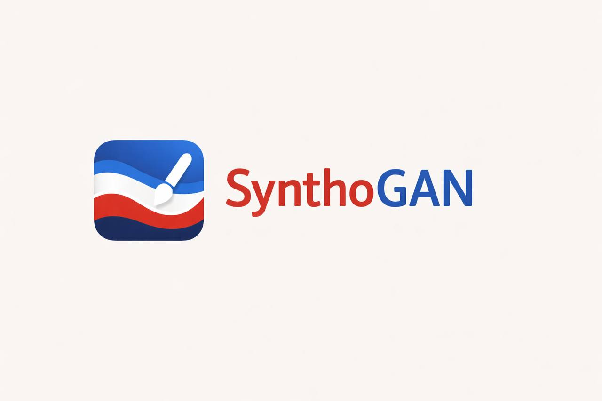

# synthogan-2d



## Описание

**synthogan-2d** — десктопное приложение для генерации 2D‑масок геологических слоёв и синтеза сейсмических срезов с помощью GAN.  
Проект помогает быстро получать синтетические сейсмические данные на основе параметризованных горизонтов, разломов и искажений, что ускоряет эксперименты, разметку и тестирование моделей.

Как это работает:
- Пользователь задаёт параметры и/или рисует горизонты и разломы вручную.
- Из горизонтов формируется маска слоёв.
- GAN‑модель строит сейсмический срез по маске и накладывает его поверх.

Технологии:
- **Python**, **PySide6** — интерфейс.
- **NumPy / SciPy** — математика и обработка.
- **TensorFlow** — генерация сейсмики.

## Установка

### Общие требования
- Python **3.12–3.13** (см. `pyproject.toml`)
- Установленные драйверы/библиотеки для TensorFlow (по желанию, если нужен GPU)

### Linux
```bash
python -m venv .venv
source .venv/bin/activate
pip install --upgrade pip
pip install -r requirements.txt
```

### macOS
```bash
python3 -m venv .venv
source .venv/bin/activate
pip install --upgrade pip
pip install -r requirements.txt
```

### Windows (PowerShell)
```powershell
python -m venv .venv
.venv\Scripts\Activate.ps1
pip install --upgrade pip
pip install -r requirements.txt
```

### Установка через Poetry

Если предпочитаете Poetry (используется `pyproject.toml`):
```bash
pip install poetry
poetry install
```

## Запуск
```bash
python app/main.py
```

## Участие в проекте

Будем рады любому вкладу:
- создавайте **issue** с багами и предложениями;
- предлагайте улучшения UI/UX и генерации;
- присылайте pull‑request’ы с фиксами и новыми возможностями.

Если у вас есть идея — смело открывайте обсуждение!